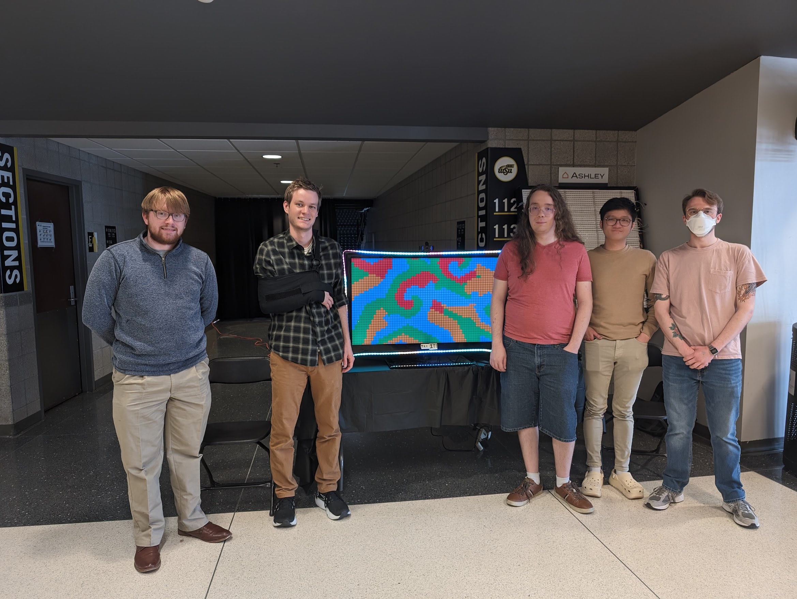

# DOTRIX
## An interactive art display
-----
### Chris Farley, Everett Kernen, Liam Kilgore, Josef Matson, James Tran, and Micah Wallace
### Wichita State University Senior Design Project, 2024
-----
Our team's senior design goal was to create an interactive art installation to be semi-permanently located in WSU's engineering student center building. 

### How to run
Clone the repo, then run [sim_base.py](visuals/sim_base.py). A randomly selected simulation in either Python or JavaScript will run. If you have a camera attached to your computer, it will search for hands in the camera frame. Using the hand locations as inputs, the Python sims will change state in some manner and the JS sims will move your mouse cursor for interaction.

## Group picture and demo video

[Demo Video](https://youtu.be/wV1_poGhPCU)

## Credits
We were given permission by [Chris Shier](https://csh.bz/) to use his JavaScript simulations for non-commercial use. Check him out!

Erik Fransson gave us permission to use his [game of life simulations](https://gitlab.com/erikfransson/game_of_life) as a base to build our own simulations on top of.

A huge thanks to both people as well as the engineering staff at Wichita State University for supporting this project, in particular [Dr. Cindi Mason](https://www.wichita.edu/profiles/academics/engineering/ISME/01_Faculty/Mason-Cindi.php)
